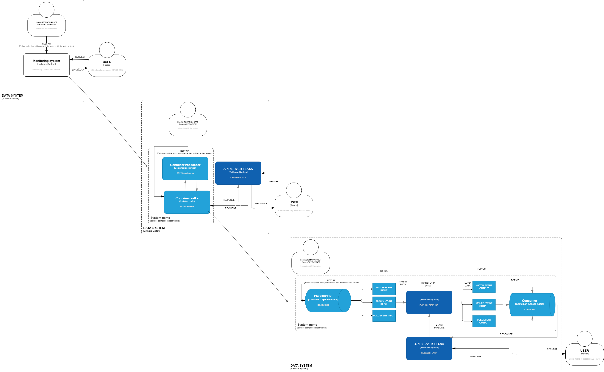

# Explanation of the development

Assignment is a project composed by the following techonologies:
* API REST
* FLINK(in detail the python version for support pipeline streaming data)
- APACHE KAFKA(in order to guaranatee a stream processing)
- FLASK(in order to manage API REST)

The main task is to develop a data system able to monitor custom metrics:
* Calculate the average time between pull requests for a given repository.
* Return the total number of events grouped by the event type for a given offset. The offset determines how much time we want to look back i.e., an offset of 10 means we count only the events which have been created in the last 10 minutes.
* Return the total number of events to a specific event type for a given offset. The offset determines how much time we want to look forward i.e., an offset of 10 means we count only the events which have been created in the next 10 seconds.

## Architecture
How we could see from the bottom architecture image presented following C4 model [link](https://c4model.com/) we will have two main actors:
* one responsible for flushing information as a producer in the correct input topic. This person we have assume is internal at data system
* one who is simulated the client that did the API GET REST.This user will be outside at the data system.
In particular data is taken from the following REST API [link](https://api.github.com/events) that records all events.


     
How is possible to see from the top left to right bottom we have given different layers view, using a top-down methodology.
We can see the two actors previous cited, that interact with the data system composed by two main containers one responible of maintining up zookeeper and another one for generate kafka broker queues. Both are necessary in order to guarantee the advantages of Kafka framework(high availability, fault talerance). Another important component is the Flask custom app for allowing final user to interact with the data system. In particular Flask is a user-friendly library which let us to create server and API rest with low lines of code.
 
Following with the last layer we have a better interpretation of how flow runs.
Data coming from producer are going to stored into queue system(kafka) separated by type to different topics.Now the pipeline did the classic map reduce approach where took the data from a source( input topic) and apply the right transformation based on the specific api and then flush all the informations to a sink (output topic).
This suggested architecture lets us to work with real time application exchanging data using Streaming Environments.

## Installation

* install python3 (suggested 3.8 or 3.7)

* JAVA 8 OR JAVA 11(Check: java --version)

*. INSTALL AdoptJDK

* Install Pyflink with pip

##### Create the virtual environment
Create virtual environment and activate it
Activate the virtual environment appling 
```bash
python -m venv NameEnvironment
source NameEnvironment/Script/activate
```
Use the requirements file for install all the libraries required:    

```bash
pip install -r requirements.txt
pip install --upgrade httpie
```
In the same directory of the python script we need to install the jar files for having the interaction with kafka between pyflink
```bash
http --download https://repo.maven.apache.org/maven2/org/apache/flink/flink-sql-connector-kafka_2.11/1.13.0/flink-sql-connector-kafka_2.11-1.13.0.jar
```

Another importan step is to launch the following command before starts 
```bash
docker-compose up -d
```
## Usage
In order to analyze the correct works we need to follow the rules:
* docker-compose up
* execute producer_Kafka.py(where how you could see, is need an interaction) with 1 printed in stdin you push data in correct topic
* execute main.py (according this you power on the server in order to do get API)
* run the different GET to a specific
## Available REST API
####  WatchEvent REST API
* [Time_window_after](http://127.0.0.1:8080/WatchEvent/minutes/lazy/<int:minutes>) http://127.0.0.1:8080/WatchEvent/minutes/lazy/<int:minutes>
* [Time_window_behind](http://127.0.0.1:8080/WatchEvent/minutes/<int:minutes>) http://127.0.0.1:8080/WatchEvent/minutes/<int:minutes>
####  PullRequestEvent REST API
* [Time_window_after](http://127.0.0.1:8080/PullRequestEvent/minutes/lazy/<int:minutes>) http://127.0.0.1:8080/PullRequestEvent/minutes/lazy/<int:minutes>
* [Time_window_behind](http://127.0.0.1:5000/PullRequestEvent/minutes/<int:minutes>) http://127.0.0.1:8080/PullRequestEvent/minutes/<int:minutes>
* [average_time](http://127.0.0.1:8080/PullRequestEvent/repository_id/<int:repository_id>) http://127.0.0.1:8080/PullRequestEvent/repository_id/<int:repository_id>
####  IssuesEvent REST API
* [Time_window_after](http://127.0.0.1:8080/IssuesEvent/minutes/lazy/<int:minutes>) http://127.0.0.1:8080/IssuesEvent/minutes/lazy/<int:minutes>
* [Time_window_behind](http://127.0.0.1:8080/IssuesEvent/minutes/<int:minutes>) http://127.0.0.1:8080/IssuesEvent/minutes/<int:minutes>
## Next works
* Create new metrics
* Insert a storaging 
* create a dashboard for monitoring infrastructure
## License
Andrea Lombardo
